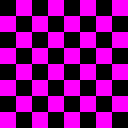
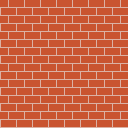

# What is Spencer BMP
It is a custom [.BMP image](https://en.wikipedia.org/wiki/BMP_file_format) parser written entirely in C. This allows you to either open existing or create a new BMP files from C using an easy to understand & simple library. You are able to read/write the entire info header & pixel data of the image allowing for direct lowlevel control of all aspects of BMP files.

# Examples

Checkerboard Pattern Generator <br/>
`gcc -o checkerboard documentation/examples/checkerboard-texture-example.c bmp.c`</br>
`./checkerboard`
```c
#include <stdio.h>
#include <stdint.h>
#include "bmp.h"

static void create_checkerboard_texture(color_32bpp_t* pixels, unsigned int width, unsigned int height, 
                                        unsigned int squares_x, unsigned int squares_y, 
                                        color_32bpp_t color1, color_32bpp_t color2);

int main() {
    bmp_t bmp;
    unsigned int width = 128, height = 128;

    bmp_init_data(&bmp, width, height, 32);
    color_32bpp_t* colors = (color_32bpp_t*)bmp.data;

    color_32bpp_t magenta = {255, 0, 255, 255};
    color_32bpp_t black = {0, 0, 0, 255};       

    create_checkerboard_texture(colors, width, height, 8, 8, magenta, black);

    bmp_save(&bmp, "checkerboard_texture.bmp");
    bmp_destroy(&bmp);
    
    return 0;
}

static void create_checkerboard_texture(color_32bpp_t* pixels, unsigned int width, unsigned int height, 
                                        unsigned int squares_x, unsigned int squares_y, 
                                        color_32bpp_t color1, color_32bpp_t color2) {
    unsigned int square_width = width / squares_x;
    unsigned int square_height = height / squares_y;

    for (unsigned int y = 0; y < height; y++) {
        for (unsigned int x = 0; x < width; x++) {
            unsigned int offset = (y * width) + x;
            unsigned int square_x = x / square_width;
            unsigned int square_y = y / square_height;
            
            // Determine the color based on the square's position
            color_32bpp_t current_color = ((square_x + square_y) % 2 == 0) ? color1 : color2;

            pixels[offset] = current_color;
        }
    }
}
```

## Output:
### checkerboard_texture.bmp



Brick Pattern Generator<br/>
`gcc -o bricks documentation/examples/brick-texture-example.c bmp.c` <br/>
`./bricks`
```c
#include <stdio.h>
#include <stdint.h>
#include "bmp.h"


static void create_brick_texture(color_32bpp_t* pixels, unsigned int width, unsigned int height, 
                                 unsigned int horiz_bricks, unsigned int vert_bricks, 
                                 color_32bpp_t brick_color, color_32bpp_t mortar_color);

int main() {
    bmp_t bmp;
    unsigned int width = 128, height = 128;

    bmp_init_data(&bmp, width, height, 32);
    color_32bpp_t* colors = (color_32bpp_t*)bmp.data;

    color_32bpp_t brick_color = {48, 84, 201, 255};
    color_32bpp_t mortar_color = {164, 177, 219, 255};

    create_brick_texture(colors, width, height, 8, 16, brick_color, mortar_color);

    bmp_save(&bmp, "brick_texture.bmp");
    bmp_destroy(&bmp);
    
    return 0;
}

static void create_brick_texture(color_32bpp_t* pixels, unsigned int width, unsigned int height, 
                                 unsigned int horiz_bricks, unsigned int vert_bricks, 
                                 color_32bpp_t brick_color, color_32bpp_t mortar_color) {
    unsigned int h_brick_size = width / horiz_bricks;
    unsigned int v_brick_size = height / vert_bricks;

    for (unsigned int y = 0; y < height; y++) {
        for (unsigned int x = 0; x < width; x++) {
            unsigned int offset = (y * width) + x;
            color_32bpp_t cur_color;

            if (y % v_brick_size == 0) {
                cur_color = mortar_color;
            } else if ((y / v_brick_size) % 2 == 0) {
                cur_color = (x % h_brick_size == 0) ? mortar_color : brick_color;
            } else {
                cur_color = ((x + (h_brick_size / 2)) % h_brick_size == 0) ? mortar_color : brick_color;
            }

            pixels[offset] = cur_color;
        }
    }
}
```
## Output:
###  brick_texture.bmp
